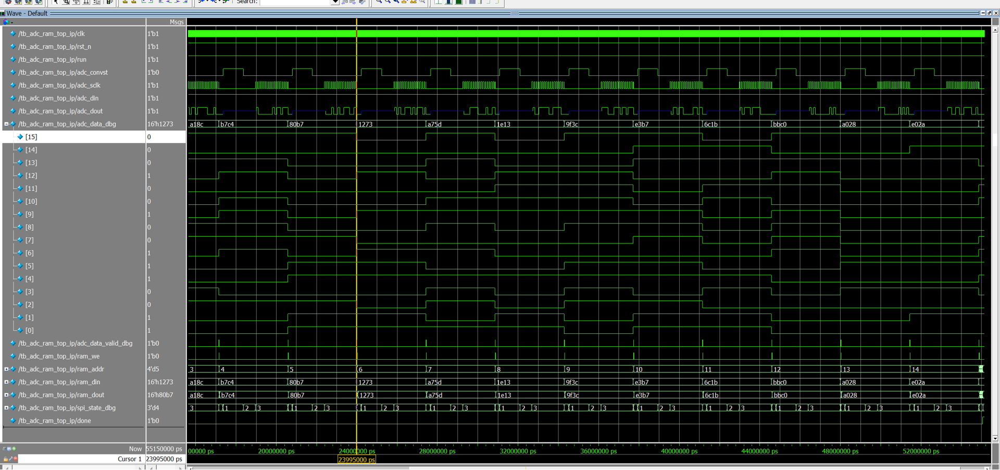
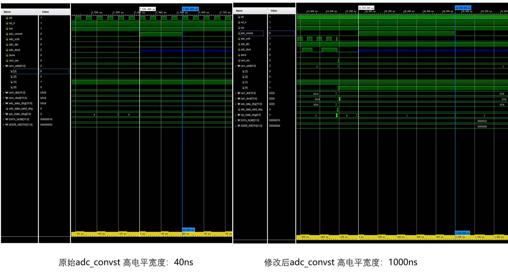

# ADS8862-SPI-RAM

基于 ADS8862 的 SPI 数据采集、16 位串行数据接收与 Block RAM 缓存 RTL 设计及仿真验证。

A small RTL design and simulation verification project for ADS8862 ADC data acquisition and RAM buffering.

---

## Project Overview

This project implements an FPGA-side acquisition and buffering interface for the ADS8862 16-bit SAR ADC.

The design generates the required conversion control and serial clock timing, receives the ADC conversion result through the serial interface, converts the serial data into 16-bit parallel data, and stores the sampled data into Block RAM.

A SystemVerilog testbench and ADS8862 behavioral model are used for functional simulation and timing analysis.

本项目主要用于练习基于 Datasheet 的接口时序分析、RTL 设计、SystemVerilog Testbench 编写以及 ModelSim / Vivado 仿真验证流程。

---

## Features

- ADS8862 conversion control
- SPI serial clock generation
- 16-bit ADC serial data acquisition
- Serial-to-parallel data conversion
- ADC data valid generation
- Block RAM data buffering
- Configurable conversion wait timing
- Configurable sampling interval
- ADS8862 behavioral model
- SystemVerilog Testbench
- ModelSim simulation
- Vivado simulation

---

## Architecture

```text
        ADS8862 Behavioral Model
                  |
                  | DOUT
                  v
        +--------------------+
        | ADS8862 SPI Master |
        +---------+----------+
                  |
                  | 16-bit ADC Data
                  v
        +--------------------+
        |     Block RAM      |
        +--------------------+
## Simulation Results

### ModelSim Simulation



### Vivado Simulation


